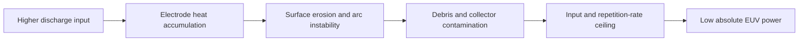
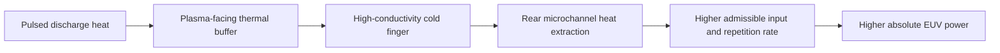

# Cools DPP Thermal Clutch EUV

## Cools patented cooling can enable DPP to surpass LPP-class EUV power

> **DPP did not lose because discharge plasma was fundamentally inferior.**  
> **It lost because the electrode could not survive the heat.**

[한국어](README_KR.md) · [中文](README_ZH.md)

## Core proposition

Laser-Produced Plasma (LPP) dominates high-power Extreme Ultraviolet (EUV) generation through a complex chain: a megawatt-class CO₂ drive laser, beam delivery, tin-droplet generation, free-space plasma control, and debris mitigation.

Discharge-Produced Plasma (DPP) can remove most of that chain by generating tin plasma directly from electrical discharge. Its decisive scaling limit has been the plasma-facing electrode: heat accumulation, erosion, arc-foot instability, hydrogen damage, and debris.

**Cools proposes that applying its patented conductive-cooling architecture to the DPP electrode removes this thermal ceiling. Once the electrode can accept higher input power and higher repetition rate, DPP can offset lower plasma conversion efficiency with greater absolute power and can scale beyond LPP-class EUV output.**

## The wrong comparison

The conventional comparison focuses only on plasma conversion efficiency:

| Source | Representative plasma CE |
|---|---:|
| LPP | ~6% |
| Tin DPP | ~2% |

That comparison is incomplete.

The system-level question is:

> **How much EUV power reaches the intermediate focus per unit wall-plug power, system volume, and thermal limit?**

LPP carries the burden of the drive laser, beam transport, droplet system, debris-mitigation transmission loss, timing control, and optical contamination management. DPP has lower plasma CE, but it is directly electrically driven and has a solid structure through which heat can be deliberately extracted.

## Why old DPP stopped scaling



The old DPP problem was therefore not simply “low CE.” The electrode imposed a thermal ceiling before the source could exploit higher electrical input.

## What Cools changes

Cools applies a directionally asymmetric thermal architecture — **EUV forward, heat backward**.



The architecture separates two thermal events:

1. **Transient pulse heat** is buffered at the plasma-facing region.
2. **Accumulated average heat** is continuously extracted through a rear conductive path and microchannel cooling.

The objective is not merely to make an electrode last longer. It is to **release the input-power ceiling that kept DPP below LPP**.

## From efficiency competition to power scaling

The Cools thesis is:

```text
Old DPP
Electrode thermal limit → limited input → limited repetition rate → low absolute EUV power

Cools-cooled DPP
Thermal limit released → higher input + higher repetition rate
→ lower CE offset by thermal headroom
→ LPP-class and potentially beyond-LPP absolute EUV power
```

In compact form:

> **Lower CE does not require lower EUV output when the allowable input power and repetition rate are substantially higher.**

## Supporting electrode functions

Cooling is the primary scaling lever. The following functions stabilize the architecture at high power:

- **Self-renewing tin surface:** absorbs plasma-facing damage without permanently accumulating surface defects.
- **F-locked boundary:** blocks hydrogen penetration into the electrode body and suppresses blistering, delamination, and debris generation.
- **Annular electrode geometry:** opens the optical axis and enables forward axial collection.
- **Replaceable debris shielding:** protects the collector-side environment while maintaining serviceability.

These are not separate product stories. They support one central result: **keep the DPP electrode stable while the patented cooling architecture raises the allowable power level.**

## LPP versus Cools-cooled DPP

| Item | LPP | Conventional DPP | Cools-cooled DPP concept |
|---|---|---|---|
| Plasma generation | CO₂ laser on flying Sn droplet | Electrical discharge | Electrical discharge |
| Drive laser | Required | Not required | Not required |
| Droplet generator | Required | Not required | Not required |
| Main thermal bottleneck | Free-space optical environment | Electrode erosion | Rear conductive extraction |
| Debris control | Large DMS burden | Historically severe | F-locked boundary + renewable surface + shield |
| Collection geometry | Free-space collection | Electrode shadowing | Annular axial collection |
| Scaling path | Higher laser and optical-system power | Blocked by electrode heat | Higher electrical input and repetition rate |
| System complexity | High | Low | Low |

## Strategic meaning

Cools is not proposing another incremental DPP electrode.

> **Cools is applying its patented conductive-cooling architecture to the one component that prevented DPP from scaling: the plasma-facing electrode.**

If that thermal ceiling is removed, DPP retains its structural advantages over LPP:

- direct electrical drive,
- no megawatt-class CO₂ laser chain,
- no precision droplet generator,
- lower system complexity,
- smaller footprint,
- a direct solid-state path for extracting heat.

The result is a credible route to a simpler and potentially higher-power EUV source architecture.

## Development objective

This repository presents a source-architecture proposition and design target. The next validation steps are:

1. electrode thermal-impedance and pulse-temperature testing,
2. repetition-rate scaling under controlled discharge,
3. electrode erosion and debris measurement,
4. intermediate-focus EUV power measurement,
5. wall-plug-to-IF efficiency comparison against LPP-class reference systems.

## Core claim

> **DPP failed because its electrode could not be cooled. Apply Cools patented conductive cooling, release the thermal ceiling, and DPP can surpass LPP-class EUV power.**

## Intellectual property and transaction options

The cooling architectures, electrode structures, thermal-control sequences, source-system concepts, figures, and associated implementation know-how described in this repository are protected, as applicable, by granted patents, pending patent applications, and proprietary know-how of Cools Inc.

Cools is open to structured discussions with qualified strategic partners. Depending on the source architecture, field, territory, and transaction scope, potential structures may include:

- exclusive or non-exclusive patent licensing;
- field-of-use or territory-limited rights;
- cooling architecture and source-system technology transfer;
- joint electrode, source, and collector-system development;
- strategic investment or transfer of the relevant technology business; and
- where commercially appropriate, assignment or transfer of the relevant patents, patent applications, and associated rights themselves.

**Negotiations are not limited to a licence. Where the transaction purpose and conditions are appropriate, the relevant patent portfolio itself may be included in the transaction.**

Any transaction is subject to technical and legal due diligence and a definitive written agreement.

---

**Dr. Jinhyun Cho — Founder & CEO, Cools Inc.**  
Email: [jhcho@cools.co.kr](mailto:jhcho@cools.co.kr)

For technical review, licensing, patent-inclusive transactions, technology transfer, investment, joint development, or source-system collaboration, please contact Cools Inc.

## Notice

This repository describes a Cools source-architecture proposal and associated patented or patent-pending cooling concepts. Publication does not grant any licence, implied right, waiver, or permission to practise the disclosed technology. All relevant patent rights, pending application rights, technical materials, figures, and associated commercial rights are reserved by Cools Inc.

© 2026 Cools Inc. All rights reserved.